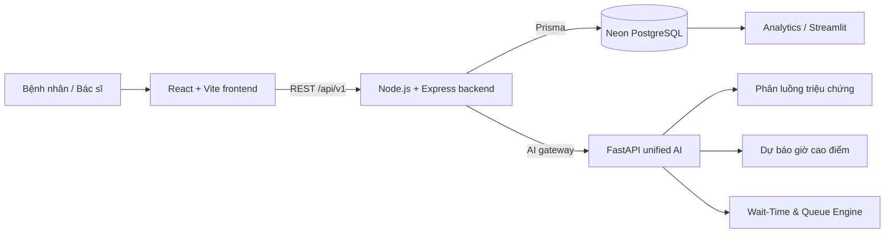

# MedFlow

**Nền tảng số hóa hành trình khám bệnh và hỗ trợ điều phối phòng khám bằng AI.**

MedFlow kết nối luồng bệnh nhân, bác sĩ, hàng đợi và mô hình AI trong một hệ thống thống nhất. Bệnh nhân có thể check-in, khai báo triệu chứng, nhận phòng phù hợp và theo dõi hành trình khám; bác sĩ theo dõi hàng đợi, gọi bệnh nhân, khám và tạo chỉ định; bộ máy AI hỗ trợ phân luồng triệu chứng, dự báo giờ cao điểm và ước lượng thời gian chờ.

[](https://render.com/deploy?repo=https://github.com/kieuwangtruong/MedFlow)

> **Lưu ý y tế:** dữ liệu và mô hình trong repository phục vụ demo/hackathon, sử dụng dữ liệu tổng hợp và **không được xác thực lâm sàng**. Hệ thống không thay thế quyết định của nhân viên y tế.

## Điểm nổi bật

- Check-in bằng CCCD tại cổng bệnh nhân hoặc kiosk tự phục vụ.
- Khai báo triệu chứng, mức độ đau và dấu hiệu nguy hiểm.
- AI phân loại khoa/phòng, phát hiện red flag và trả mức độ tin cậy.
- Tạo số thứ tự và lưu lộ trình khám theo từng bệnh nhân.
- Hàng đợi bác sĩ theo phòng và ca trực đang hoạt động.
- Quản lý khám bệnh, chỉ định dịch vụ và luồng chờ kết quả.
- Ước lượng thời gian chờ theo P50/P80/P90 và mô phỏng tác động khi đổi phòng.
- Dự báo khung giờ check-in cao điểm và dashboard phân tích vận hành.
- Triển khai monorepo bằng Render Blueprint, dữ liệu lưu trên Neon PostgreSQL.

## Kiến trúc



| Lớp | Công nghệ |
|---|---|
| Frontend | React 19, TypeScript, Vite, Tailwind CSS, TanStack Query |
| Backend | Node.js, Express 5, Prisma ORM, JWT, Zod |
| AI | Python 3.12, FastAPI, pandas, scikit-learn, SQLAlchemy |
| Database | PostgreSQL trên Neon |
| Analytics | Streamlit, SQL, EDA và báo cáo vận hành |
| Deployment | Render Blueprint: Static Site + Node Web Service + Python Web Service |

## Tài khoản demo

### Bệnh nhân

| Cách đăng nhập | Giá trị | Mật khẩu |
|---|---|---|
| CCCD demo có sẵn | `001204012345` — Nguyễn Văn An | Không cần |
| Lượt test mới | Một chuỗi **9–12 chữ số** chưa sử dụng, ví dụ `090000000123` | Không cần |

Nhập họ tên và CCCD mới sẽ tự tạo hồ sơ bệnh nhân demo. Chỉ sử dụng thông tin giả lập, không nhập dữ liệu định danh thật.

### Bác sĩ

Mật khẩu chung cho toàn bộ tài khoản bác sĩ demo: **`12345678`**

| Tài khoản | Bác sĩ | Phòng trực demo |
|---|---|---|
| `bs.nguyen.minh.khang@vaic.vn` | BS. Nguyễn Minh Khang | Tổng quát 101 (`PK-TQ-101`) |
| `nam01@gmail.com` | BS. Nguyễn Văn Nam | Phân loại Cấp cứu 102 (`CC-102`) |
| `bs.le.quang.huy@vaic.vn` | BS. Lê Quang Huy | Tim mạch 201 (`TM-201`) |
| `bs.pham.thu.ha@vaic.vn` | BS. Phạm Thu Hà | Thần kinh 202 (`TK-202`) |
| `bs.vo.thanh.dat@vaic.vn` | BS. Võ Thành Đạt | Tai Mũi Họng 203 (`TMH-203`) |
| `bs.dang.ngoc.anh@vaic.vn` | BS. Đặng Ngọc Anh | Da liễu 204 (`DL-204`) |
| `bs.bui.tuan.kiet@vaic.vn` | BS. Bùi Tuấn Kiệt | Nhi 301 (`NK-301`) |
| `bs.do.my.linh@vaic.vn` | BS. Đỗ Mỹ Linh | Sản Phụ khoa 302 (`SPK-302`) |
| `bs.hoang.gia.bao@vaic.vn` | BS. Hoàng Gia Bảo | Cơ Xương Khớp 303 (`CXK-303`) |
| `bs.ngo.thanh.van@vaic.vn` | BS. Ngô Thanh Vân | Tiêu hóa - Gan mật 304 (`TH-304`) |
| `bs.tran.hoang.lan@vaic.vn` | BS. Trần Hoàng Lan | Mắt 403 (`MAT-403`) |

> Các thông tin đăng nhập trên chỉ dành cho môi trường demo. Không tái sử dụng mật khẩu này trong môi trường thật.

## Kịch bản demo đề xuất

### Chuẩn bị trước khi trình bày

MedFlow đang chạy trên gói [Render Free](https://render.com/docs/free). Backend và AI có thể ngủ sau một thời gian không hoạt động, vì vậy lần truy cập đầu tiên có thể mất khoảng 1–2 phút.

1. Mở service `medflow-backend` trên Render và truy cập URL public của service.
2. Mở service `medflow-ai` và chờ endpoint `/health` trả kết quả thành công.
3. Mở URL của `medflow-frontend` và chờ trạng thái máy chủ trên trang đăng nhập chuyển sang sẵn sàng.
4. Nếu lần phân tích triệu chứng đầu tiên gặp `502`, chờ AI khởi động hoàn tất rồi gửi lại một lần.

### Luồng bệnh nhân — khoảng 3 phút

1. Mở trang đăng nhập và giữ chế độ **Cổng bệnh nhân**.
2. Nhập họ tên và CCCD demo `001204012345`, hoặc dùng thông tin giả lập mới để tạo lượt test sạch.
3. Chọn **Lấy số khám**, hoàn tất biểu mẫu check-in.
4. Khai báo triệu chứng, ví dụ:

   ```text
   Đau mỏi cổ từ sáng, hơi cứng khi xoay đầu, mức đau 4/10.
   ```

5. Gửi biểu mẫu và xem kết quả AI: khoa, phòng, độ tin cậy và mức ưu tiên.
6. Mở **Lộ trình** để xem phòng hiện tại, số thứ tự và các bước khám đã lưu.

### Luồng bác sĩ — khoảng 3 phút

1. Đăng xuất hoặc mở một cửa sổ ẩn danh.
2. Chọn **Đăng nhập nhân viên**.
3. Dùng `bs.nguyen.minh.khang@vaic.vn` / `12345678` để vào phòng Tổng quát 101.
4. Mở **Hàng đợi**, tìm bệnh nhân vừa check-in và gọi lượt.
5. Mở hồ sơ khám, cập nhật nội dung khám và tạo chỉ định dịch vụ nếu cần.
6. Quay lại cổng bệnh nhân để quan sát lộ trình và trạng thái được cập nhật.

### Luồng kiosk — khoảng 1 phút

1. Từ trang đăng nhập, chọn **Mở chế độ kiosk**.
2. Nhập họ tên và một CCCD giả lập 9–12 chữ số chưa sử dụng.
3. Xác nhận check-in và ghi nhận mã lượt khám.
4. Quay lại cổng bệnh nhân, đăng nhập bằng cùng CCCD để khai báo triệu chứng.

## Chạy local

### Yêu cầu

- Node.js 22 và npm.
- Python 3.12.
- PostgreSQL hoặc một Neon database cho backend.

### 1. Cấu hình môi trường

```powershell
Copy-Item backend\.env.example backend\.env
Copy-Item frontend\.env.example frontend\.env
Copy-Item ai\.env.example ai\.env
```

Cập nhật tối thiểu `DATABASE_URL`, `JWT_SECRET`, `APP_ORIGIN`, `AI_SERVICE_URL` trong `backend/.env`. Không commit file `.env` hoặc credential thật.

### 2. Cài dependency

```powershell
cd backend
npm ci
npm run prisma:generate

cd ..\frontend
npm ci

cd ..\ai
python -m venv .venv
.\.venv\Scripts\python.exe -m pip install --upgrade pip
.\.venv\Scripts\python.exe -m pip install -r requirements.txt
```

### 3. Chuẩn bị database demo

Với database đã có lịch sử migration:

```powershell
cd backend
npm run prisma:deploy
npm run prisma:seed
npm run prisma:seed:clinic
npm run prisma:seed:staff
```

Các mật khẩu seed được đọc từ `SEED_ADMIN_PASSWORD`, `SEED_DOCTOR_PASSWORD` và `SEED_NURSE_PASSWORD`. Chỉ dùng các giá trị mặc định trong môi trường local/demo.

### 4. Chạy ba service

Mở ba terminal riêng:

```powershell
# Terminal 1 — AI
cd ai
.\.venv\Scripts\python.exe -m uvicorn main:app --host 127.0.0.1 --port 8000
```

```powershell
# Terminal 2 — Backend
cd backend
npm run dev
```

```powershell
# Terminal 3 — Frontend
cd frontend
npm run dev
```

Frontend mặc định chạy tại `http://localhost:5173`, backend tại `http://localhost:3000` và AI tại `http://localhost:8000`.

## Kiểm thử

```powershell
cd backend
npm run lint
npm test
npm run prisma:validate

cd ..\frontend
npm run lint
npm test
npm run build
```

Smoke test end-to-end với backend đã chạy:

```powershell
$env:SMOKE_BACKEND_URL='http://localhost:3000'
$env:SMOKE_PATIENT_CCCD='090000000123'
node scripts\smoke\e2e.mjs
```

## Triển khai

File [`render.yaml`](render.yaml) tạo ba service:

- `medflow-frontend`: React/Vite static site.
- `medflow-backend`: Node/Express API và Prisma migration.
- `medflow-ai`: FastAPI unified AI service.

Xem hướng dẫn chi tiết tại [`DEPLOYMENT.md`](DEPLOYMENT.md) và danh sách biến môi trường tại [`RENDER_ENV_VARS.md`](RENDER_ENV_VARS.md).

## Cấu trúc repository

```text
.
├── frontend/       React application cho bệnh nhân, bác sĩ và quản trị
├── backend/        Express API, Prisma schema, migration và seed scripts
├── ai/             Symptom routing, peak forecast và wait-time engine
├── analytics/      EDA, SQL, Streamlit dashboard và báo cáo
├── docs/           Kiến trúc, API contract, hướng dẫn tích hợp và giới hạn
├── scripts/        Smoke test và công cụ hỗ trợ
└── render.yaml     Render Blueprint cho môi trường demo
```

## Tài liệu

- [Kiến trúc hệ thống](docs/ARCHITECTURE.md)
- [API contract](docs/API_CONTRACT.md)
- [Hướng dẫn tích hợp](docs/INTEGRATION_GUIDE.md)
- [Routing Agent handoff](docs/ROUTING_AGENT_HANDOFF.md)
- [Data Analytics](analytics/README.md)
- [Giới hạn và giả định](docs/LIMITATIONS.md)
- [Báo cáo xác minh kỹ thuật](docs/VERIFICATION_REPORT.md)

## Phạm vi và giới hạn

- Model và dữ liệu analytics hiện là **SYNTHETIC_ONLY** và **NOT_CLINICALLY_VALIDATED**.
- Gói Render Free có cold start; nên làm nóng backend và AI trước khi demo.
- Analytics chưa được public trong Blueprint vì chưa có lớp kiểm soát truy cập phù hợp.
- Hệ thống là sản phẩm demo kỹ thuật, không phải phần mềm y tế dùng trong vận hành thực tế.
