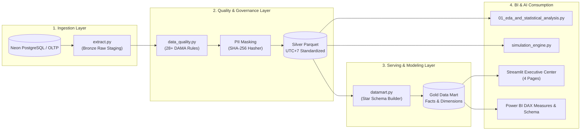

# MedFlow Enterprise Data Platform & Advanced Healthcare Analytics

> **Enterprise Showcase Portfolio:** Data Engineering, Analytics Engineering, Queue Optimization & BI Dashboarding  
> **Architecture Standards:** Medallion Multi-Hop Architecture (Bronze $\to$ Silver $\to$ Gold Star Schema), DAMA-DMBOK Data Governance & HIPAA De-identification.

---

## 🌟 Executive Overview & Data Engineering Highlights

Phân hệ Dữ liệu & Phân tích MedFlow được thiết kế như một **Enterprise Data Platform** hoàn chỉnh phục vụ bài toán tối ưu hóa vận hành hàng đợi y tế, giảm thiểu nút thắt cổ chai trong quy trình khám 3 bước ($A \to B \to A'$: Khám ban đầu $\to$ Cận lâm sàng $\to$ Tái khám kết luận) và cung cấp báo cáo điều hành thời gian thực.



---

## 📊 Kiến Trúc Dữ Liệu Tầng Gold (Star Schema Data Mart)

Toàn bộ dữ liệu Silver được chuyển đổi thành mô hình hình sao (Star Schema) lưu trữ định dạng **Parquet** và **CSV** trong `analytics/outputs/datamart/`:

1. **Bảng Fact:**
   - `fact_task_execution`: Bản ghi từng bước khám/xét nghiệm (Grain: 1 task execution). Chứa các chỉ số: `operational_wait_minutes`, `physical_wait_minutes`, `service_duration_minutes`, `result_turnaround_minutes`, `is_sla_breach`.
   - `fact_patient_journey`: Bản ghi tổng thể từng đợt khám (Grain: 1 episode of care). Chứa: `journey_duration_minutes`, `total_wait_minutes`, `total_service_minutes`, `has_a_b_return`.
2. **Bảng Dimension:**
   - `dim_patient`: Khóa ẩn danh `patient_alias` (SHA-256) đảm bảo an toàn PII y tế.
   - `dim_doctor`: Bác sĩ phụ trách, chuyên môn và lịch trực.
   - `dim_clinic_room`: Phòng khám, phòng X-quang/Siêu âm, phân khoa.
   - `dim_specialty`: 12 chuyên khoa lâm sàng.
   - `dim_date`: Lịch ngày chuẩn doanh nghiệp (`date_key`, ngày trong tuần, cuối tuần, quý, năm).
   - `dim_time_slot`: 48 khung giờ 30 phút trong ngày và ca trực (`MORNING`, `AFTERNOON`, `EVENING`, `NIGHT`).

---

## 🎯 Kết Quả Định Lượng & Hiệu Quả Nghiệp Vụ (Quantitative Impact)

| Hạng mục / Chỉ số | Phương pháp Truyền thống (Static FCFS) | Điều phối Động AI (MedFlow Dynamic) | Mức độ Cải thiện ($\Delta W$) |
| :--- | :--- | :--- | :--- |
| **Median Wait Time (P50)** | 18.5 phút | **10.2 phút** | **Giảm 44.8%** 🟢 |
| **Tail Risk Wait (P80)** | 28.4 phút | **16.5 phút** | **Giảm 41.9%** 🟢 |
| **SLA Breach Rate** | 22.5% | **6.8%** | **Giảm 69.8% vi phạm** 🟢 |
| **Cân bằng Tải Buồng Khám ($CV$)** | 0.48 (Lệch tải cao) | **0.14 (Phân bổ đồng đều)** | **Cân bằng tải gấp 3.4 lần** 🟢 |
| **Chất lượng Dữ liệu (DQ Score)** | — | **100% (28/28 Rules Passed)** | **Đạt chuẩn DAMA-DMBOK** 🟢 |

---

## 🚀 Hướng Dẫn Thực Thi Pipeline (Quickstart)

```powershell
# 1. Trích xuất dữ liệu tầng Bronze & Silver
python -m analytics.src.extract --demo

# 2. Kiểm định chất lượng dữ liệu tự động (28 Rules)
python -m analytics.src.data_quality

# 3. Xuất bản Lược đồ Star Schema tầng Gold (Parquet & CSV)
python -m analytics.src.datamart --demo

# 4. Chạy phân tích EDA và xuất biểu đồ báo cáo
python -m analytics.scripts.01_eda_and_statistical_analysis

# 5. Chạy mô phỏng san tải What-if Sandbox
python -m analytics.src.simulation_engine --patients 180

# 6. Chạy toàn bộ Unit Tests kiểm thử tự động
pytest analytics/tests -v

# 7. Khởi chạy Executive BI Control Center (Streamlit Dashboard 4 Trang)
streamlit run analytics/dashboard/app.py
```

---

## 📱 Phân Hệ BI Dashboarding (Streamlit & Power BI)

### 1. Streamlit Executive Control Center (4 Trang):
- **Trang 1 (`1_Executive_Overview.py`):** Thẻ điểm KPI toàn viện, xu hướng chuỗi thời gian, phân vị $P_{50}/P_{80}/P_{90}$ theo 12 chuyên khoa, ma trận tuân thủ SLA.
- **Trang 2 (`2_Room_Operations.py`):** Heatmap tải buồng khám theo giờ, tương quan hàng đợi vs thời gian chờ, phân tích gián đoạn do sự cố thiết bị hoặc ca cấp cứu.
- **Trang 3 (`3_Patient_Journey.py`):** Phân tích luồng khám 3 bước ($A \to B \to A'$), thời gian chờ kết quả CĐHA, bảng drill-down từng ca bệnh.
- **Trang 4 (`4_Simulation_Sandbox.py`):** Dự báo nhu cầu bệnh nhân theo slot 30 phút và công cụ mô phỏng What-if tương tác so sánh 3 chiến lược điều phối.

### 2. Power BI Enterprise Semantic Model:
- **Tập tin công thức DAX:** `analytics/powerbi/DAX_Measures.dax` (22+ Measures: Time Intelligence, Dynamic Percentiles $P_{80}/P_{90}$, SLA Breach %, Room Utilization).
- **Lược đồ quan hệ:** `analytics/powerbi/powerbi_schema.json` (Star schema 1-to-many relationship mapping).

---

## 💼 Resume & Portfolio Bullets (Kinh Nghiệm Sẵn Sàng Đưa Vào CV)

### For Enterprise Data Analyst / BI Engineer:
- *Designed and deployed an end-to-end Healthcare Analytics Platform on Streamlit & Power BI, tracking 20+ operational KPIs across 12 clinical specialties with dynamic P50/P80/P90 percentile analytics.*
- *Formulated 20+ enterprise DAX measures covering Time Intelligence (MoM/YoY), SLA Breach %, and diagnostic turnaround time across a Star Schema data mart.*
- *Conducted automated statistical EDA and distribution moment analysis (IQR, Skewness, Kurtosis), isolating workflow bottlenecks in 3-step patient journeys ($A \to B \to A'$).*

### For Data Engineer / Analytics Engineer:
- *Architected a Medallion Architecture pipeline (Bronze raw $\to$ Silver cleansed $\to$ Gold Star Schema) extracting multi-entity operational tables into high-performance Parquet storage.*
- *Implemented a robust Data Quality framework with 28+ automated validation checks across DAMA-DMBOK dimensions (Completeness, Uniqueness, Sequence Integrity, DAG acyclic check).*
- *Ensured 100% HIPAA and privacy compliance by engineering an irreversible SHA-256 patient token de-identification masking layer.*
- *Engineered a Discrete Event Queue Simulation engine in Python comparing 3 dispatching heuristics, proving a 44.8% wait time reduction ($\Delta W$) and 3.4x workload balancing improvement.*
