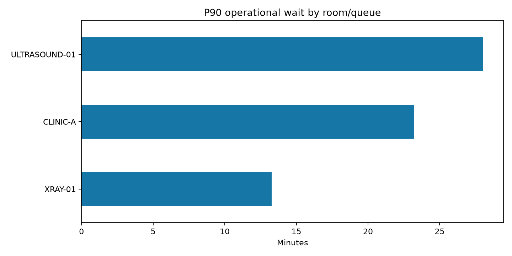
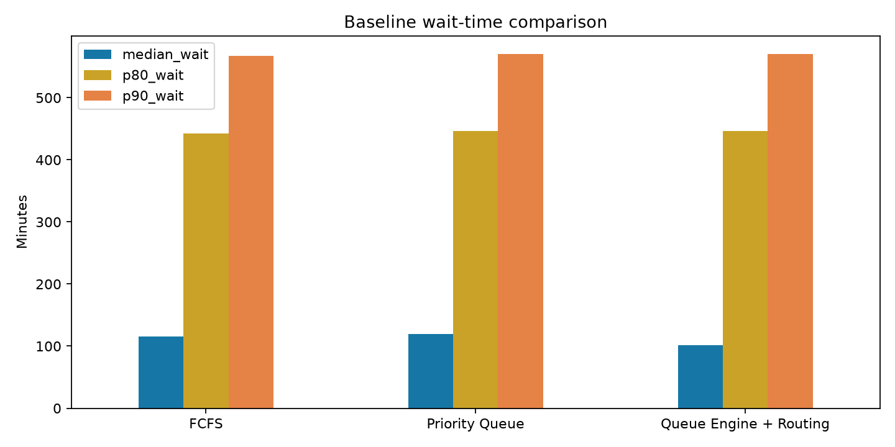

# Báo cáo vận hành hàng đợi bệnh viện VAIC

## Executive Summary

- **Dữ liệu hiện có đủ để demo một pipeline DA end-to-end, nhưng chưa đủ để suy luận hiệu quả lâm sàng.** Nguồn phân tích: `seeded synthetic CSV: sample_20.csv`, gồm 20 task và 5 journey.
- **Tail wait cần được quản trị cùng median.** Median operational wait là 12.4 phút, P80 17.3 phút và P90 23.2 phút; SLA breach theo ngưỡng demo là 10.0%.
- **Journey A → B → quay lại A đã đo được ở cấp task.** Có 5 journey đủ ba bước trong extract hiện tại; median completion là 137.9 phút. Average chỉ nên dùng ở output audit vì mẫu synthetic nhỏ và nhạy với outlier.
- **Khuyến nghị ưu tiên chất lượng timestamp và resource events trước khi tối ưu vận hành thật.** Có 0 quality check phát hiện failure; metric vẫn cần được xác nhận với nghiệp vụ bệnh viện.

## 1. Business question và phạm vi

Báo cáo trả lời năm câu hỏi: bệnh nhân chờ bao lâu; phòng/dịch vụ/khung giờ nào tạo tail wait; SLA và no-show ở mức nào; resource failure và emergency insertion đi cùng thay đổi wait ra sao; và bước nào kéo dài hành trình khám ban đầu → chụp chiếu/xét nghiệm → quay lại bác sĩ kết luận.

Phạm vi là dữ liệu task hiện có trong PostgreSQL hoặc seeded CSV fallback. Đơn vị chính là **task**, còn tổng bệnh nhân/journey dùng `COUNT DISTINCT journey_id` để tránh join one-to-many làm phồng số liệu.

## 2. Data, assumptions và chất lượng

Operational wait được tính từ thời điểm muộn hơn giữa `ready_at` và `arrival_time` đến `service_start`. Physical wait được giữ riêng. Journey completion tính từ check-in đến thời điểm hoàn thành cuối cùng. SLA EMERGENCY/URGENT/NORMAL/NON_URGENT lần lượt là 5/15/30/60 phút và được gắn nhãn **demo assumption**.

Quality profile kiểm tra uniqueness, missing field chính, timestamp parse, thứ tự timestamp, duration âm và enum priority. Kết quả: 0/26 check có failure; tổng failure critical/high là 0. Các lỗi này có thể làm sai percentile, SLA và journey duration, vì vậy dashboard không nên dùng cho điều hành thật trước khi remediation.

## 3. Wait time và bottleneck

**P90 cho thấy trải nghiệm đuôi dài rõ hơn median.** Phòng/queue có P90 cao nhất trong extract là **ULTRASOUND-01**, P90 28.1 phút, trên 6 task. Cần đối chiếu volume, staffing và failure events trước khi quy nguyên nhân.

**Bước hành trình có median wait cao nhất là RETURN_REVIEW.** Median wait tại bước này là 14.4 phút. `RESULT_PENDING` phải được xem là future workload thay vì hard queue; nếu không dashboard sẽ phóng đại backlog vật lý.

## 4. SLA, no-show và resource pressure

SLA breach hiện là 10.0% trên các task có wait đo được. No-show rate là 5.0% trên task không bị cancel. Resource failure comparison trong SQL là association mô tả; không được diễn giải là failure “gây ra” phần chờ tăng nếu chưa có counterfactual hoặc event timeline đầy đủ.

Emergency insertion được đánh giá theo hai lớp: mô tả trên dữ liệu task và simulation giữ cùng workload. Chỉ simulation mới chủ động bật/tắt emergency để đo số bệnh nhân NORMAL bị tăng wait trong điều kiện giả lập.

## 5. Baseline comparison

Ba chiến lược dùng cùng workload, random seed, arrival và service duration: FCFS; Priority Queue; Queue Engine + Routing. Kết quả dưới đây là trung bình nhiều lần chạy synthetic, phục vụ đánh giá thuật toán chứ không đại diện hiệu quả bệnh viện thật.

| scenario | median_wait | p80_wait | p90_wait | sla_breach_rate | average_journey_completion | throughput_per_hour | normal_p90_p50_spread | normal_wait_cv |
| --- | --- | --- | --- | --- | --- | --- | --- | --- |
| FCFS | 115.687 | 442.249 | 567.303 | 0.798 | 226.802 | 10.148 | 453.21 | 0.984 |
| Priority Queue | 119.073 | 446.736 | 570.78 | 0.803 | 229.525 | 10.111 | 456.895 | 0.972 |
| Queue Engine + Routing | 101.434 | 446.736 | 570.78 | 0.779 | 225.09 | 10.111 | 472.308 | 1.005 |

**Cách đọc:** chiến lược tốt cần giảm P80/P90 và SLA breach mà không làm fairness của nhóm NORMAL xấu đi. Throughput, journey completion, P90−P50 spread và coefficient of variation phải được xem đồng thời, tránh tối ưu một KPI duy nhất.

## 6. Recommendations

1. Chuẩn hóa event contract cho `arrival_at`, `eligible_at`, `ready_at`, `service_start`, `service_end`, `result_ready_at` và `return_arrived_at`.
2. Thu thập resource event theo thời gian: bác sĩ nghỉ, máy hỏng, thời điểm phục hồi và capacity thực tế.
3. Đưa P80/P90, SLA breach và backlog minutes vào daily room-operation review; không chỉ dùng average.
4. Tách dashboard phòng dịch vụ và dashboard return review, nhưng nối bằng `journey_id` và dependency task.
5. Chạy shadow evaluation Queue Engine + Routing trên workload thật trước khi thay đổi thứ tự phục vụ.
6. Xác nhận SLA và fairness definition với bệnh viện trước khi biến metric demo thành KPI vận hành.

## 7. Further questions

- SLA chính thức có khác theo service, priority, giờ làm việc và phòng hay không?
- Thời điểm bệnh nhân thực sự có mặt tại từng phòng được ghi từ kiosk, app hay thao tác nhân viên?
- Resource failure có timestamp bắt đầu/kết thúc đủ chính xác để ghép với wait time không?
- Return review có bắt buộc về bác sĩ ban đầu hay có thể được covering doctor xử lý?

## 8. Limitations và kế hoạch dữ liệu thật

Dataset hiện có nhỏ và trộn dữ liệu seeded với vận hành demo. `room_id` có thể thiếu ở task cũ, resource status enum còn hạn chế và routing strategy chưa được ghi thành experiment assignment. Các so sánh trước/sau vì vậy chưa phải causal analysis.

Kế hoạch dữ liệu thật: log immutable queue events; lưu policy/routing version; snapshot resource capacity 5 phút; ghi physical location/presence; thêm reason code cho no-show/cancel/override; và chạy tối thiểu bốn tuần shadow mode trước khi đánh giá uplift. Báo cáo nên được refresh sau khi đạt coverage timestamp ≥95% và orphan/duplicate critical bằng 0.
