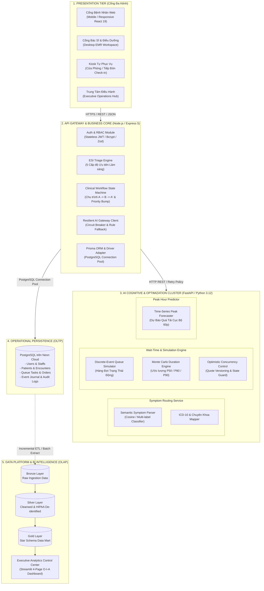
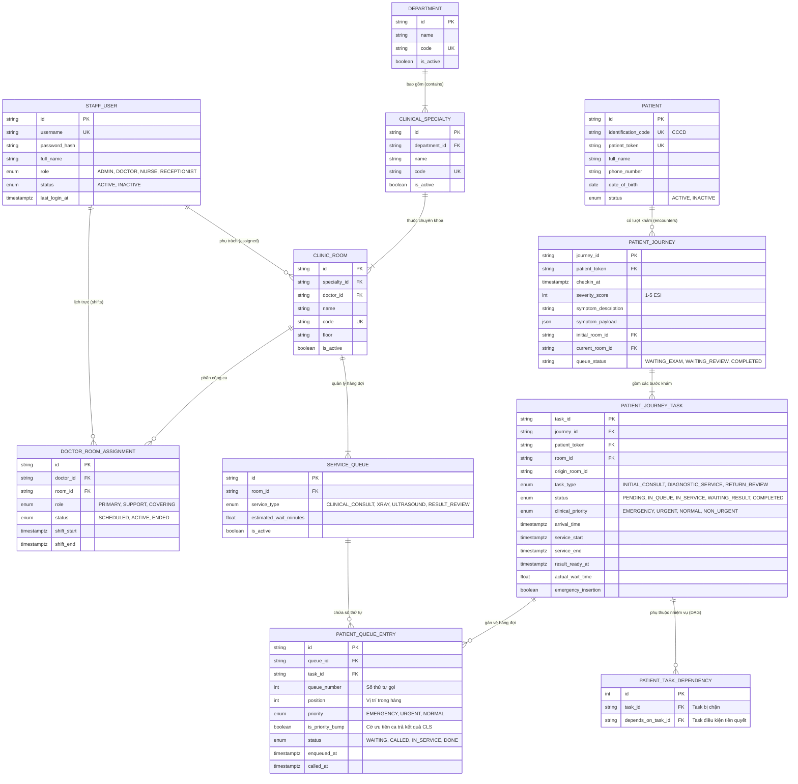
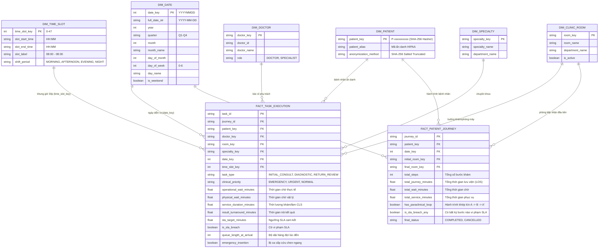
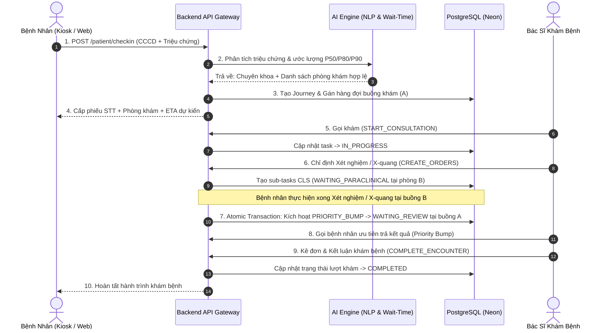

# Kiến trúc Kỹ thuật Hệ thống Medi-Flow AI (Architecture Blueprint)

Tài liệu đặc tả toàn diện kiến trúc kỹ thuật của hệ sinh thái **Medi-Flow AI**, bao gồm:
1. **Kiến trúc Microservices Phân tán (Distributed Microservices Architecture)**
2. **Sơ đồ Quan hệ Thực thể (ERD) Cơ sở Dữ liệu Vận hành OLTP**
3. **Lược đồ Hình sao (Star Schema) của Data Mart Phân tích Luồng Bệnh nhân (OLAP)**
4. **Quy trình Điều phối & Luồng Dữ liệu Phân tán (Distributed Sequence Workflow)**

---

## 1. Kiến trúc Microservices Phân tán (Distributed Microservices Architecture)

Medi-Flow AI áp dụng mô hình phân tầng enterprise (Multi-Tier Architecture), tách bạch rạch ròi giữa hệ thống vận hành khám bệnh thời gian thực (**OLTP**) và cụm mô hình phân tích tối ưu hóa trí tuệ nhân tạo (**AI/OLAP**).

### Các Đặc Tính Phân Tán Cốt Lõi:
* **Khả năng chịu lỗi (Resilience & Circuit Breaker):** Backend Node.js và Cụm AI Python được kết nối lỏng (Loosely Coupled). Khi AI Microservice gặp mã lỗi `404/502` hoặc quá tải, Gateway tự động kích hoạt bộ luật lâm sàng dự phòng nội bộ (Rule-based Fallback) đưa bệnh nhân vào phòng khám an toàn mà không làm gián đoạn hệ thống.
* **Kiểm soát đồng thời lạc quan (Optimistic Concurrency Control - OCC):** Cụm hàng đợi AI phát hành phiên bản báo giá `estimate_version` cho mỗi đề xuất. Nếu trạng thái phòng thay đổi trước khi xác nhận gán buồng, hệ thống trả về mã `409 REQUOTE_REQUIRED` để tránh xung đột tải.
* **Bảo mật phi trạng thái (Stateless Security):** Giao tiếp giữa Client và Gateway thông qua Bearer JWT Token được ký mật mã; mật khẩu nhân viên được hash bằng PBKDF2/Bcrypt.

---

## 2. Sơ đồ Quan hệ Thực thể (ERD) Cơ sở Dữ liệu Vận hành OLTP

Hệ thống OLTP quản trị thông tin lâm sàng trên **PostgreSQL (Neon)** thông qua **Prisma ORM**, đảm bảo chuẩn hóa dữ liệu (3NF) và tính toàn vẹn tham chiếu nghiêm ngặt:

---

## 3. Lược Đồ Hình Sao (Star Schema) Của Data Mart Phân Tích Luồng Bệnh Nhân

Tầng dữ liệu phân tích (**Gold Layer**) được mô hình hóa theo dạng **Star Schema**, tối ưu hóa cho các truy vấn OLAP, báo cáo BI thời gian thực trên Streamlit và mô hình hóa DAX trên Power BI:

---

## 4. Chu Trình Điều Phối Khép Kín $A \to B \to A'$ (Sequence Diagram)

Quy trình giải quyết triệt để nút thắt cổ chai lớn nhất trong bệnh viện: **Bệnh nhân sau khi làm cận lâm sàng quay lại đọc kết quả được hệ thống tự động ưu tiên (Priority Bump), không phải xếp hàng lại từ đầu**:

---

*MedFlow Distributed Healthcare Architecture Blueprint © 2026.*  
*Tuân thủ tiêu chuẩn DAMA-DMBOK Framework & HIPAA De-identification Standards.*
