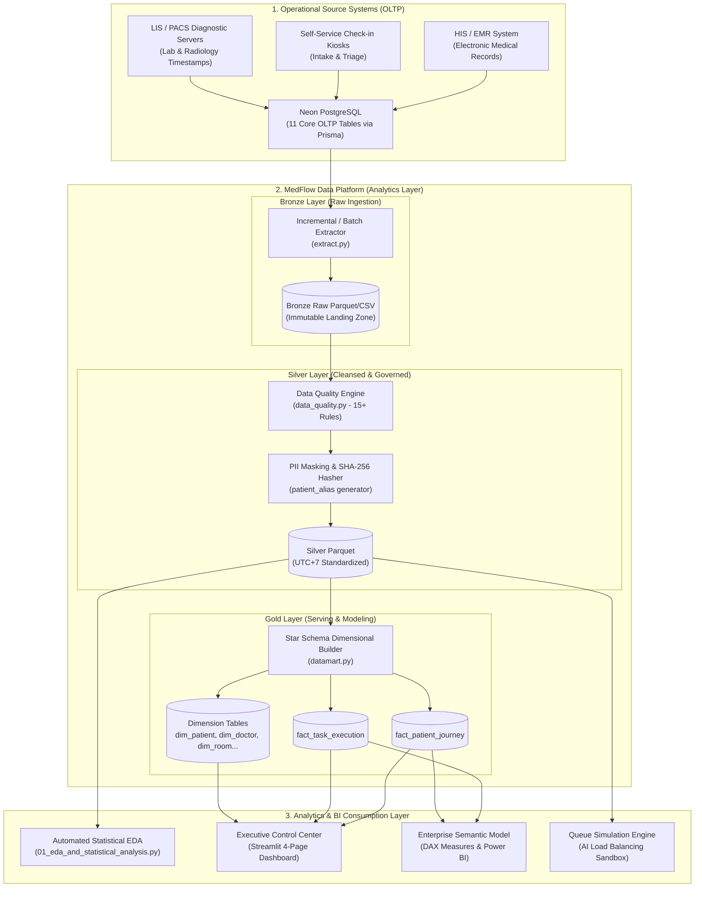
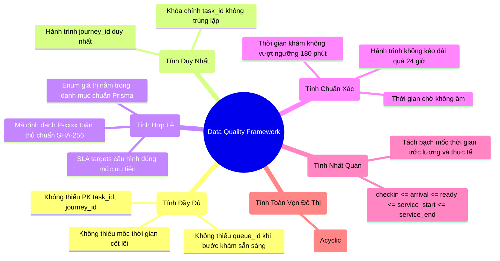

# Data Architecture & Engineering Blueprint - MedFlow Analytics Platform

> **Target Audience:** Enterprise Data Engineers, Analytics Engineers, Solution Architects & Lead Data Analysts  
> **Classification:** Healthcare Operational Intelligence & Predictive Analytics Platform  
> **Standard:** Medallion Data Architecture (Bronze $\to$ Silver $\to$ Gold) & HIPAA-Compliant De-identification  

---

## 1. High-Level System Context (C4 Context Diagram)

---

## 2. Medallion Data Architecture (Multi-Hop Ingestion)

### 2.1. Tầng Bronze (Raw Landing Zone)
- **Bản chất:** Lưu trữ nguyên trạng (As-is) dữ liệu trích xuất từ cơ sở dữ liệu vận hành Neon PostgreSQL hoặc dữ liệu hạt giống (Synthetic Seeded Extract).
- **Tính chất:** Bất biến (Immutable), lưu trữ kèm trường `extracted_at` và `source_provenance`.
- **Định dạng:** Lưu trữ dạng file CSV/Parquet thô trong `analytics/outputs/bronze/`.

### 2.2. Tầng Silver (Cleansed, Validated & Anonymized)
- **Xử lý dữ liệu:**
  1. **Anonymization & Privacy Hashing:** Băm bảo mật `patient_token` $\to$ `patient_alias = 'P-' + SHA256(patient_token)[:10]`. Tuyệt đối không lưu trữ `full_name`, `phone_number` hoặc số định danh CCCD.
  2. **Timestamp Normalization:** Chuẩn hóa toàn bộ chuỗi thời gian UTC về múi giờ y tế địa phương `Asia/Ho_Chi_Minh` (UTC+7).
  3. **Data Quality Validation:** Bộ 15+ luật kiểm định chất lượng dữ liệu (Null checks, Sequence validity, Outlier clipping, DAG acyclic check).
  4. **Derived Metrics Calculation:** Tính toán thời gian chờ vận hành (`operational_wait_minutes`), thời gian phục vụ (`service_duration_minutes`), thời gian trả kết quả cận lâm sàng (`result_turnaround_minutes`).

### 2.3. Tầng Gold (Curated Dimensional Data Mart)
- **Lược đồ:** Star Schema (Mô hình hình sao kim cương) tối ưu hóa cho truy vấn phân tích đa chiều (OLAP) và kết nối trực tiếp với Power BI, Tableau, DuckDB và Streamlit.
- **Bảng Fact:**
  - `fact_patient_journey`: 1 dòng = 1 lượt khám. Phân tích thời gian lưu viện (LOS), tỷ lệ khám 3 bước $A \to B \to A'$, số bước trung bình.
  - `fact_task_execution`: 1 dòng = 1 bước dịch vụ y tế. Phân tích phân vị thời gian chờ $P_{50}/P_{80}/P_{90}$, tỷ lệ vi phạm SLA, năng suất phòng và bác sĩ.
- **Bảng Dimension:** `dim_patient`, `dim_doctor`, `dim_clinic_room`, `dim_specialty`, `dim_date`, `dim_time_slot`.

---

## 3. Quy Trình Kiểm Soát Chất Lượng Dữ Liệu (Data Quality Framework)

Hệ thống thiết lập ma trận kiểm soát chất lượng dữ liệu theo tiêu chuẩn DAMA-DMBOK với 6 chiều chất lượng chính:

---

## 4. Mô Hình Ẩn Danh Hóa & Tuân Thủ Bảo Mật Y Tế (Healthcare PII Masking)

1. **Nguyên tắc One-Way Cryptographic Hashing:**
   $$\text{patient\_alias} = \text{"P-"} + \text{SHA256}(\text{patient\_token} + \text{Salt})[0:10]$$
2. **Loại bỏ hoàn toàn thông tin định danh trực tiếp (Direct Identifiers):**
   - Loại bỏ: `full_name`, `phone_number`, `identification_code`.
   - Giữ lại các trường nhân khẩu học phi định danh: `age_group`, `gender`.
3. **Phát hiện rò rỉ dữ liệu tự động:**
   - Trong quá trình xuất bản sang tầng Silver/Gold, nếu cột `patient_token` còn tồn tại hoặc `patient_alias` không đúng mẫu regex `^P-[0-9a-f]{10}$`, pipeline sẽ lập tức ném ngoại lệ `Critical Data Quality Failure` và dừng quá trình ingestion.

---

## 5. Chiến Lược Mô Phỏng Tối Ưu Hóa Hàng Đợi (Queue Simulation Strategy)

Hệ thống cung cấp công cụ mô phỏng toán học thực nghiệm (`simulation_engine.py`) để đánh giá 3 chiến lược điều phối:

1. **Baseline FCFS (First-Come, First-Served):** Đến trước phục vụ trước thuần túy.
2. **Priority-Aware Scheduling (Phân Luồng Ưu Tiên Cố Định):** Xếp thứ tự ưu tiên `EMERGENCY (SLA 5m) > URGENT (SLA 15m) > NORMAL (SLA 30m) > NON_URGENT (SLA 60m)`.
3. **AI-Driven Load Balancing & Dynamic Routing (Điều Phối Thông Minh Đa Phòng):**
   - Định tuyến động bệnh nhân đến phòng khám/máy có thời gian chờ ước tính $P_{80}$ ngắn nhất.
   - Hạn chế tối đa nút thắt cổ chai tại bước trả kết quả ($A \to B \to A'$).
   - Tối ưu hóa hệ số cân bằng tải $CV = \sigma / \mu$ giữa các buồng khám.
