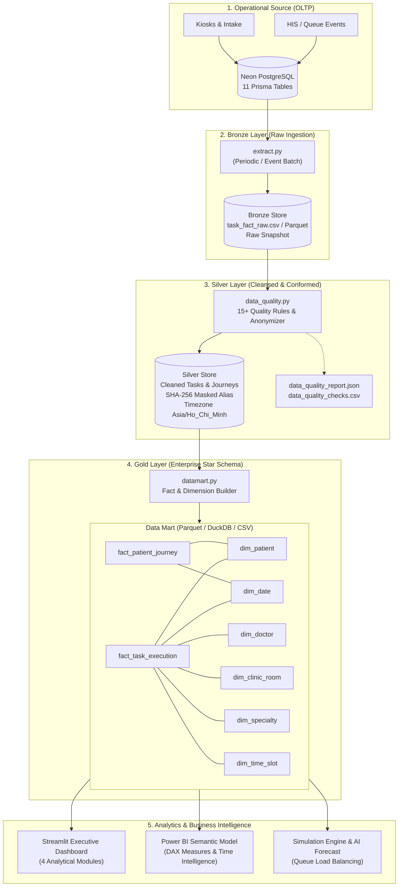

# MedFlow Data Architecture & Engineering Specifications
## Enterprise Medallion & Star Schema Architecture

Tài liệu thiết kế kiến trúc phân hệ Dữ liệu & Phân tích MedFlow (Hospital Operational & Queue Analytics Engine), được chuẩn hóa theo mô hình **Medallion Architecture** và **Dimensional Modeling (Star Schema)** chuẩn DAMA-DMBOK và The Data Warehouse Toolkit (Ralph Kimball).

---

## 1. High-Level Data Flow & Medallion Architecture

Hệ thống xử lý luồng dữ liệu y tế từ các điểm chạm tiếp nhận (Kiosk, Lễ tân, Bác sĩ khám, Phòng xét nghiệm) qua 3 tầng lưu trữ và tinh chỉnh:



---

## 2. Chi Tiết Các Tầng Dữ Liệu (Medallion Layers)

### 2.1. Bronze Layer (Raw Storage)
- **Mục tiêu:** Lưu trữ nguyên bản snapshot dữ liệu thô trích xuất từ cơ sở dữ liệu vận hành PostgreSQL mà không làm gián đoạn các transaction OLTP (Zero-Impact Isolation).
- **Đặc tính:** Chứa toàn bộ các trường thời gian, quan hệ khóa ngoại, dữ liệu bán cấu trúc (`symptom_payload` JSON), hỗ trợ cả chế độ trích xuất Live và Synthetic Offline Data.
- **Grain:** 1 dòng ứng với 1 bản ghi `patient_journey_tasks` hoặc sự kiện hàng đợi.

### 2.2. Silver Layer (Cleansed, Enriched & Anonymized)
- **Mục tiêu:** Làm sạch, xác thực tính toàn vẹn nghiệp vụ và ẩn danh hóa tuyệt đối thông tin định danh y tế (HIPAA / GDPR Compliance).
- **Quy trình chuyển đổi:**
  1. **Ẩn danh hóa (PII Masking):** Băm bảo mật mã bệnh nhân (`patient_token` $\to$ `patient_alias` = `P-` + `SHA256(token)[:10]`). Tuyệt đối không xuất thông tin họ tên, số điện thoại, CMND/CCCD ra phân hệ phân tích.
  2. **Chuẩn hóa chuỗi thời gian (Temporal Normalization):** Đồng bộ múi giờ sang `Asia/Ho_Chi_Minh` (UTC+7).
  3. **Làm giàu chỉ số vận hành (Feature Enrichment):**
     - $W_{operational} = \text{service\_start} - \max(\text{ready\_at}, \text{arrival\_time})$
     - $W_{physical} = \text{service\_start} - \text{arrival\_time}$
     - $D_{service} = \text{service\_end} - \text{service\_start}$
     - $T_{turnaround} = \text{result\_ready\_at} - \text{service\_end}$
     - Gắn cờ vi phạm SLA theo mức độ ưu tiên (`EMERGENCY: 5m`, `URGENT: 15m`, `NORMAL: 30m`, `NON_URGENT: 60m`).
  4. **Kiểm duyệt chất lượng (Quality Gate):** Chạy 15+ Data Quality Rules (kiểm tra DAG chu trình, thời gian âm, mâu thuẫn trạng thái).

### 2.3. Gold Layer (Dimensional Data Mart - Star Schema)
- **Mục tiêu:** Cung cấp mô hình dữ liệu đa chiều tối ưu hóa cao cho các truy vấn phân tích tổng hợp (OLAP), báo cáo BI (Power BI, Tableau) và mô hình học máy.
- **Định dạng:** Lưu trữ định dạng **Parquet** nén Snappy (tốc độ đọc cột nhanh gấp 10-50x so với CSV) và đồng bộ **CSV / DuckDB**.

---

## 3. Kiến Trúc Lược Đồ Chiều (Star Schema Dimensional Model)

```
                            +--------------------+
                            |     dim_date       |
                            +--------------------+
                            | PK  date_key       |
                            |     full_date      |
                            |     day_of_week    |
                            |     month          |
                            |     quarter        |
                            |     year           |
                            |     is_weekend     |
                            +---------+----------+
                                      | 1
                                      |
                                      | * (FK date_key)
+-----------------------+   *   +-----+-------------------------+   *   +-----------------------+
|      dim_patient      +-------+  fact_patient_journey         +-------+      dim_specialty    |
+-----------------------+       +-------------------------------+       +-----------------------+
| PK  patient_key       |       | PK  journey_key               |       | PK  specialty_key     |
|     patient_alias     |       | FK  patient_key               |       |     specialty_id      |
|     age_group         |       | FK  date_key                  |       |     specialty_name    |
|     status            |       |     intake_source             |       |     department_name   |
+-----------------------+       |     severity_score            |       +-----------+-----------+
            |                   |     total_tasks               |                   |
            |                   |     completed_tasks           |                   |
            |                   |     journey_duration_minutes  |                   |
            |                   |     total_wait_minutes        |                   |
            |                   |     has_a_b_return            |                   |
            |                   |     sla_breached_flag         |                   |
            |                   +-------------------------------+                   |
            |                                                                       |
            |                   +-------------------------------+                   |
            +-------------------+     fact_task_execution       +-------------------+
            | 1               * +-------------------------------+ *               1 |
            |                   | PK  task_execution_key        |                   |
            |                   | FK  journey_key               |                   |
            |                   | FK  patient_key               |                   |
            |                   | FK  clinic_room_key           +-------------------+
            |                   | FK  doctor_key                | 1
            |                   | FK  specialty_key             |
            |                   | FK  date_key                  |       +-----------------------+
            |                   | FK  time_slot_key             |       |    dim_clinic_room    |
            |                   |     task_type                 |       +-----------------------+
            |                   |     service_type              +-------+ PK  clinic_room_key   |
            |                   |     clinical_priority         | *   1 |     room_id           |
            |                   |     operational_wait_minutes  |       |     room_name         |
            |                   |     service_duration_minutes  |       |     room_code         |
            |                   |     result_turnaround_minutes |       |     floor             |
            |                   |     is_sla_breach             |       +-----------------------+
            |                   |     resource_failure_flag     |
            |                   |     emergency_insertion_flag  |       +-----------------------+
            |                   +---------------+---------------+       |      dim_doctor       |
            |                                   | *                     +-----------------------+
            |                                   +-----------------------+ PK  doctor_key        |
            |                                   | 1                     |     doctor_id         |
            |                   +---------------+---------------+       |     doctor_name       |
            |                   |        dim_time_slot          |       |     role              |
            |                   +-------------------------------+       +-----------------------+
            |                   | PK  time_slot_key             |
            +-------------------+     time_slot_label (HH:MM)   |
                                |     slot_index_30m            |
                                |     hour_of_day               |
                                |     is_peak_hour              |
                                +-------------------------------+
```

---

## 4. Chính Sách Bảo Mật Dữ Liệu & Tuân Thủ (Security & Governance)

1. **Nguyên tắc ẩn danh hóa một chiều (One-Way Hashing):**
   Mã số bệnh nhân `patient_token` được băm bằng thuật toán SHA-256 kết hợp tiền tố `P-` cố định, đảm bảo không thể giải mã ngược để truy tìm danh tính bệnh nhân trong khi vẫn duy trì tính nhất quán để phân tích hành trình đa lần khám.
2. **Phân quyền truy cập theo cấp độ (Role-Based Access Control):**
   - **Tầng OLTP:** Chỉ backend application và DBA có quyền truy cập bảng gốc có PII.
   - **Tầng Data Mart & BI:** Các Data Analyst và Stakeholder chỉ truy cập các bảng Fact/Dimension trong Data Mart đã được bảo vệ.
3. **Audit Trail & Provenance:**
   Mọi bản ghi Data Mart đều lưu vết nguồn trích xuất, phiên bản thuật toán làm sạch và dấu thời gian thực thi.
