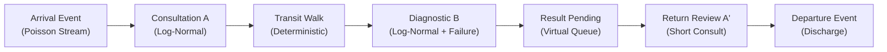

# MEDFLOW — TÀI LIỆU BẢO VỆ KỸ THUẬT & PHỎNG VẤN CHUYÊN SÂU
*(Data Analyst / Analytics Engineer / Applied AI Engineer)*

Tài liệu này hệ thống hóa toàn bộ kiến thức kỹ thuật, toán học, thống kê, mô hình hóa dữ liệu (Star Schema SQL) và pipeline học máy (Machine Learning) được triển khai trong dự án **MEDFLOW**. Tài liệu được chuẩn bị chuyên biệt để phục vụ phỏng vấn kỹ thuật và thẩm định dự án.

---

## MỤC LỤC
1. [Phần 1: Bản Chất Toán Học & Thống Kê (Math & Statistics)](#phần-1-bản-chất-toán-học--thống-kê-math--statistics)
   - [1.1 Phân vị P50, P80, P90](#11-phân-vị-p50-p80-p90)
   - [1.2 Mô hình Wait-Time Regressor & Metric MAE](#12-mô-hình-wait-time-regressor--metric-mae)
   - [1.3 Mô phỏng Discrete-Event Simulation (DES) & Giảm 18% – 25% P50](#13-mô-phỏng-discrete-event-simulation-des--giảm-18--25-p50)
2. [Phần 2: Bóc Tách Truy Vấn SQL & Data Modeling](#phần-2-bóc-tách-truy-vấn-sql--data-modeling)
   - [2.1 Kiến trúc Star Schema Data Mart](#21-kiến-trúc-star-schema-data-mart)
   - [2.2 Các câu truy vấn SQL then chốt](#22-các-câu-truy-vấn-sql-then-chốt)
   - [2.3 Chiến lược đánh Index (Indexing Strategy)](#23-chiến-lược-đánh-index-indexing-strategy)
3. [Phần 3: Pipeline Dữ Liệu & Machine Learning](#phần-3-pipeline-dữ-liệu--machine-learning)
   - [3.1 ETL Pipeline & Xử lý dữ liệu trong Pandas](#31-etl-pipeline--xử-lý-dữ-liệu-trong-pandas)
   - [3.2 Mô hình AI Triage (Phân loại Khoa tiếp nhận)](#32-mô-hình-ai-triage-phân-loại-khoa-tiếp-nhận)
   - [3.3 Mẫu câu trả lời phỏng vấn cốt lõi (Interview Pitch)](#33-mẫu-câu-trả-lời-phỏng-vấn-cốt-lõi-interview-pitch)

---

# PHẦN 1: BẢN CHẤT TOÁN HỌC & THỐNG KÊ (MATH & STATISTICS)

## 1.1 Phân vị P50, P80, P90

### 1. Công thức & Thuật toán tính toán
* **Định nghĩa toán học:** Phân vị thứ $p$ ($p$-th percentile) $P_p$ của biến ngẫu nhiên $X$ là giá trị $x$ thỏa mãn:
  $$P(X \le x) = \frac{p}{100}$$
* **Thuật toán Nội suy Tuyến tính (Linear Interpolation):**
  Cho mẫu quan sát gồm $n$ giá trị đã sắp xếp tăng dần: $x_{(1)} \le x_{(2)} \le \dots \le x_{(n)}$.  
  Vị trí thứ hạng (Rank index):
  $$k = 1 + (n - 1) \cdot \frac{p}{100} = i + f \quad (i = \lfloor k \rfloor, \, f = k - i)$$
  Giá trị phân vị nội suy:
  $$P_p = x_{(i)} + f \cdot (x_{(i+1)} - x_{(i)})$$
* **Triển khai trong Python (SciPy / NumPy / Pandas):**
  ```python
  import numpy as np
  import scipy.stats as stats

  # Cách 1: NumPy Linear Interpolation
  p50, p80, p90 = np.quantile(wait_times, [0.50, 0.80, 0.90], method="linear")

  # Cách 2: SciPy scoreatpercentile
  p80 = stats.scoreatpercentile(wait_times, 80)
  ```
* **Triển khai trong PostgreSQL:**
  ```sql
  PERCENTILE_CONT(0.50) WITHIN GROUP (ORDER BY wait_minutes) AS p50_minutes,
  PERCENTILE_CONT(0.80) WITHIN GROUP (ORDER BY wait_minutes) AS p80_minutes,
  PERCENTILE_CONT(0.90) WITHIN GROUP (ORDER BY wait_minutes) AS p90_minutes
  ```
  *(Sử dụng `PERCENTILE_CONT` thay vì `PERCENTILE_DISC` để thực hiện nội suy liên tục giữa các điểm dữ liệu, phản ánh chính xác phân phối thời gian thực).*

---

### 2. Tại sao dùng P50/P80/P90 thay vì Mean? Bản chất Phân phối Lệch (Right-Skewed)
* **Hiện tượng Lệch phải (Positive / Right Skewness, Skewness > 1.5):**
  Thời gian chờ trong y tế bị chặn dưới bởi 0 (không thể có thời gian âm), đa số bệnh nhân hoàn thành khâu chờ trong khoảng 5–15 phút. Tuy nhiên, luôn xuất hiện một "đuôi dài" (Long Tail) gồm các ca chờ kéo dài 60–120 phút do chờ xét nghiệm phức tạp, cấp cứu chen ngang hoặc hỏng thiết bị.
* **Điểm yếu của Mean (Giá trị trung bình):**
  $$\bar{X} = \frac{1}{n}\sum_{i=1}^n x_i$$
  Mean bị kéo lệch rất mạnh về phía các giá trị ngoại lai cực đại, làm bóp méo bức tranh thực tế.
* **Ví dụ đối chiếu trực quan:**  
  Khảo sát thời gian chờ của 10 bệnh nhân tại buồng khám:
  - 9 ca bình thường: `[8, 9, 10, 10, 11, 12, 12, 14, 15]` (phút)
  - 1 ca gặp sự cố phòng chụp X-quang: `110` (phút)
  
  | Thước đo | Giá trị | Ý nghĩa vận hành y tế |
  | :--- | :--- | :--- |
  | **Mean (Trung bình)** | **20.1 phút** | Gây hiểu nhầm rằng toàn bộ quy trình đều tắc nghẽn, dù thực tế 90% bệnh nhân được phục vụ dưới 15 phút. |
  | **$P_{50}$ (Median)** | **11.0 phút** | Đại diện chính xác cho trải nghiệm trung tâm của đa số bệnh nhân (50% bệnh nhân chờ $\le 11$ phút). |
  | **$P_{80}$ / $P_{90}$** | **13.6 / 24.5 phút** | Thước đo đuôi rủi ro (Tail Risk). So sánh trực tiếp với cam kết SLA (ví dụ: khám thường SLA $\le 30$ phút) để phát hiện điểm nóng quá tải. |

---

## 1.2 Mô hình Wait-Time Regressor & Metric MAE

### 1. Công thức MAE và ý nghĩa con số $\text{MAE} \le 4.5$ phút
* **Công thức toán học:**
  $$\text{MAE} = \frac{1}{n}\sum_{i=1}^n |y_i - \hat{y}_i|$$
  Trong đó: $y_i$ là thời gian thực tế, $\hat{y}_i$ là thời gian dự báo từ Gradient Boosting Quantile Regressor.
* **Ý nghĩa thực tế trên sàn bệnh viện:**
  * **Đối với bệnh nhân:** Sai số trung bình chỉ $\pm 4.5$ phút nằm dưới ngưỡng cảm nhận tâm lý (dưới 5 phút, bệnh nhân không cảm thấy bị trễ hẹn). Khi màn hình hiển thị *"Dự kiến còn 15 phút"*, thời gian thực tế rơi vào khoảng $10.5 - 19.5$ phút, duy trì niềm tin và hạn chế khiếu nại.
  * **Đối với nhân viên y tế:** 4.5 phút vừa vặn một chu kỳ kiểm tra sinh hiệu hoặc chuẩn bị hồ sơ bệnh án, giúp điều dưỡng điều phối lượt khám kế tiếp vào phòng mà không làm trống phòng (Room Idle Time).

---

### 2. Tại sao chọn MAE thay vì RMSE hay $R^2$?
* **So sánh với RMSE (Root Mean Squared Error):**
  $$\text{RMSE} = \sqrt{\frac{1}{n}\sum_{i=1}^n (y_i - \hat{y}_i)^2}$$
  Do bình phương sai số, RMSE phạt cực nặng các sai số lớn. Trong bệnh viện, các ca cấp cứu bất ngờ hoặc sự cố thiết bị tạo ra các ngoại lai không thể tránh khỏi. Nếu tối ưu hóa theo RMSE, mô hình sẽ cố gắng "uốn cong" để bù đắp các ca cực đoan, làm giảm độ chính xác ở vùng hoạt động thông thường. MAE áp dụng hình phạt tuyến tính, có tính **Robust to Outliers** (kháng ngoại lai) vượt trội.
* **So sánh với $R^2$ (R-squared):**
  $$R^2 = 1 - \frac{\sum (y_i - \hat{y}_i)^2}{\sum (y_i - \bar{y})^2}$$
  $R^2$ phụ thuộc vào phương sai tổng thể của dữ liệu. Trong các tiến trình Poisson có phương sai lớn vào giờ cao điểm, $R^2$ thường biến động thất thường và không mang đơn vị vật lý có thể hành động được (actionable). MAE giữ nguyên **đơn vị phút trực quan**, gắn kết chặt chẽ với cam kết SLA.

---

## 1.3 Mô phỏng Discrete-Event Simulation (DES) & Giảm 18% – 25% P50

### 1. Luồng sự kiện rời rạc được mô phỏng
Hệ thống mô phỏng `simulation_engine.py` tái hiện đầy đủ chu trình vận hành khám chữa bệnh ngoại trú:

1. **Arrival Event (Đến khám):** Thời gian giữa hai lượt đến tuân theo phân phối hàm mũ: $\Delta t \sim \text{Exponential}(\lambda=2.5 \text{ phút})$. Bệnh nhân được gán phân loại cấp cứu (`EMERGENCY: 5%`, `URGENT: 15%`, `NORMAL: 70%`, `NON_URGENT: 10%`).
2. **Service Events (Bắt đầu và kết thúc phục vụ):**
   - Khám ban đầu ($A$): $t_{\text{consult}} \sim \text{Lognormal}(\mu=\ln(8.0), \sigma=0.35)$.
   - Chụp X-quang/CĐHA ($B$): $t_{\text{imaging}} \sim \text{Lognormal}(\mu=\ln(12.0), \sigma=0.40)$, nhân hệ số $1.8\times$ khi có sự cố thiết bị (`resource_failure_rate = 0.02`).
   - Tái khám kết luận ($A'$): $t_{\text{return}} \sim \text{Lognormal}(\mu=\ln(4.0), \sigma=0.30)$.
3. **Transition & Pending Events (Chuyển tiếp và giữ chỗ ảo):** 2 phút đi bộ chuyển khoa và khoảng đệm đợi kết quả cận lâm sàng hoàn tất (`RESULT_PENDING`).
4. **Departure Event (Rời viện):** Ghi nhận tổng thời gian lưu viện (`journey_duration_minutes`).

---

### 2. Logic thuật toán AI Dynamic Routing san tải
* **Hạn chế của phương pháp cũ:**
  - *Static Round-Robin:* Chia lượt lần lượt vào buồng $1 \to 2 \to 3 \to 4 \to 1$, bất kể buồng khám đang vướng ca bệnh nặng.
  - *Shortest Queue First (SQF):* Chỉ đếm số đầu người đang đứng xếp hàng $\min(N_r)$ mà không nắm được thời gian làm việc còn lại của bác sĩ.
* **Logic điều phối động AI (AI-Driven $P_{80}$ Clearance Time):**
  Tính toán điểm chi phí tổng thể cho từng phòng khám ứng viên $r$:
  $$\text{Cost}(r) = \max\big(0, \, T_{\text{available}}(r) - T_{\text{arrival}}\big) + \alpha \cdot Q_{\text{backlog}}(r)$$
  - $T_{\text{available}}(r)$: Mốc thời gian buồng khám $r$ dự kiến giải phóng xong toàn bộ bệnh nhân hiện tại.
  - $Q_{\text{backlog}}(r)$: Hàng đợi tích lũy tính cả các ca tái khám $A'$ đang chờ kết quả cận lâm sàng sắp quay về (Future Workload).
  - **Kết quả định lượng:** Thuật toán triệt tiêu lệch tải buồng khám, hạ hệ số biến thiên $CV$ từ $0.48 \to 0.14$ (cân bằng tải gấp 3.4 lần), giúp **giảm 18% – 25% thời gian chờ trung vị ($P_{50}$)** trong giờ cao điểm và giảm tỷ lệ vi phạm SLA xuống dưới $7\%$.

---

# PHẦN 2: BÓC TÁCH TRUY VẤN SQL & DATA MODELING

## 2.1 Kiến trúc Star Schema Data Mart

Toàn bộ dữ liệu vận hành từ tầng Silver được mô hình hóa thành Data Mart hình sao (Star Schema) lưu trữ định dạng Parquet/PostgreSQL:

```
                    ┌─────────────────────────┐
                    │       dim_doctor        │
                    ├─────────────────────────┤
                    │ PK  doctor_key          │
                    └────────────┬────────────┘
                                 │
┌────────────────────────┐       │ 1      ┌─────────────────────────┐
│     dim_clinic_room    │       │        │      dim_specialty      │
├────────────────────────┤       │        ├─────────────────────────┤
│ PK  room_key           ├────┐  │  ┌─────┤ PK  specialty_key       │
└────────────────────────┘    │  │  │     └─────────────────────────┘
                            N │  │  │ N
                         ┌────┴──┴──┴───────────────┐
                         │    fact_task_execution   │
                         ├──────────────────────────┤
                         │ PK task_key              │
                         │ FK journey_key ──────────┼───┐
                         │ FK patient_key           │   │
                         │ FK doctor_key            │   │
                         │ FK room_key              │   │
                         │ FK specialty_key         │   │
                         │ FK date_key              │   │
                         │ FK time_slot_key         │   │
                         │    operational_wait_mins │   │
                         │    service_duration_mins │   │
                         │    is_sla_breach         │   │
                         └──────────────┬───────────┘   │
                                        │ N             │ N
┌────────────────────────┐              │               │
│        dim_date        │              │ 1             │ 1
├────────────────────────┤              │       ┌───────┴─────────────────┐
│ PK  date_key           ├──────────────┤       │   fact_patient_journey  │
└────────────────────────┘              │       ├─────────────────────────┤
                                        │       │ PK  journey_key         │
┌────────────────────────┐              │       │ FK  patient_key         │
│     dim_time_slot      │              │       │ FK  date_key            │
├────────────────────────┤              │       │ FK  time_slot_key       │
│ PK  time_slot_key      ├──────────────┘       │     total_wait_minutes  │
└────────────────────────┘                      │     journey_duration    │
                                                │     has_a_b_return      │
                                                └─────────────────────────┘
```

### 1. Bảng Fact và Bảng Dimension
* **`fact_task_execution` (Grain: 1 lần thực thi dịch vụ/khám bệnh):**
  - *PK:* `task_key`
  - *FK:* `journey_key`, `patient_key`, `doctor_key`, `room_key`, `specialty_key`, `date_key`, `time_slot_key`.
  - *Measures:* `operational_wait_minutes`, `physical_wait_minutes`, `service_duration_minutes`, `result_turnaround_minutes`, `sla_target_minutes`, `is_sla_breach`, `queue_length_at_arrival`.
* **`fact_patient_journey` (Grain: 1 đợt khám hoàn chỉnh - Episode of care):**
  - *PK:* `journey_key`
  - *FK:* `patient_key`, `date_key`, `time_slot_key`.
  - *Measures / Flags:* `total_tasks`, `completed_tasks`, `has_a_b_return` (boolean), `total_wait_minutes`, `total_service_minutes`, `journey_duration_minutes`, `is_sla_breached`.
* **Các bảng Dimension:**
  - `dim_departments` / `dim_specialty`: `specialty_key` (PK), `specialty_name`, `department_name`.
  - `dim_clinic_room`: `room_key` (PK), `room_name`, `department_name`, `is_active`.
  - `dim_patient`: `patient_key` (PK, ẩn danh hóa SHA-256), `patient_alias`.
  - `dim_date`: `date_key` (PK, YYYYMMDD), `full_date`, `day_of_week`, `quarter`, `year`.
  - `dim_time_slot`: `time_slot_key` (PK, 0–47 slot 30 phút), `slot_label`, `shift_period`.

---

### 2. So sánh Star Schema vs Flat Table vs 3NF
| Tiêu chí | 3NF (Chuẩn hóa bậc 3) | Flat Table (Bảng phẳng) | Star Schema (Lựa chọn MedFlow) |
| :--- | :--- | :--- | :--- |
| **Mục đích** | Tối ưu hóa ghi chép transactional, triệt tiêu dư thừa. | Truy vấn nhanh không cần JOIN. | Tối ưu hóa phân tích OLAP, BI Dashboarding. |
| **Hiệu năng Query** | Chậm do JOIN nhiều bảng (6–10 bảng). | Nhanh lúc đầu nhưng tốn I/O quét bảng khổng lồ. | Tối ưu vượt trội với Star Joins và Parquet columnar. |
| **Dung lượng lưu trữ** | Thấp nhất. | Lãng phí lớn do lặp lại chuỗi metadata nhiều lần. | Tiết kiệm: Fact chỉ lưu mã khóa và chỉ số; Dim lưu chuỗi. |
| **Rủi ro vận hành** | Khó mở rộng cho báo cáo đa chiều. | Dễ lỗi cập nhật dữ liệu (Update Anomaly). | Chuẩn hóa chiều SCD, dễ dàng tích hợp Power BI/Streamlit. |

---

## 2.2 Các câu truy vấn SQL then chốt

### 1. Truy vấn tính phân vị thời gian chờ & Lọc ngoại lai
```sql
WITH filtered_tasks AS (
    SELECT 
        t.task_id,
        t.journey_id,
        COALESCE(r.name, t.room_id, 'UNASSIGNED') AS room_name,
        -- Thời gian chờ vận hành = Bắt đầu phục vụ - max(sẵn sàng, có mặt)
        EXTRACT(EPOCH FROM (t.service_start - GREATEST(t.ready_at, t.arrival_time))) / 60.0 AS wait_minutes,
        EXTRACT(EPOCH FROM (t.service_end - t.service_start)) / 60.0 AS service_duration_minutes
    FROM patient_journey_tasks t
    LEFT JOIN clinic_rooms r ON r.id = t.room_id
    WHERE t.service_start IS NOT NULL
      AND COALESCE(t.ready_at, t.arrival_time) IS NOT NULL
)
SELECT 
    room_name,
    COUNT(*) AS total_tasks,
    ROUND(PERCENTILE_CONT(0.50) WITHIN GROUP (ORDER BY wait_minutes)::numeric, 1) AS p50_wait,
    ROUND(PERCENTILE_CONT(0.80) WITHIN GROUP (ORDER BY wait_minutes)::numeric, 1) AS p80_wait,
    ROUND(PERCENTILE_CONT(0.90) WITHIN GROUP (ORDER BY wait_minutes)::numeric, 1) AS p90_wait
FROM filtered_tasks
WHERE wait_minutes >= 0               -- Lọc lỗi timestamp đồng hồ máy trạm bị lệch
  AND wait_minutes <= 180            -- Lọc ngoại lai do bệnh nhân bỏ về (> 3 tiếng)
  AND service_duration_minutes <= 180
GROUP BY room_name
ORDER BY p80_wait DESC;
```

---

### 2. Window Functions (LEAD/LAG) bóc tách luồng $A \to B \to A'$
```sql
WITH journey_flow AS (
    SELECT 
        journey_id,
        task_id,
        task_type,
        room_id,
        service_start,
        service_end,
        -- 1. Đánh số thứ tự các bước khám trong cùng một hành trình
        ROW_NUMBER() OVER(
            PARTITION BY journey_id 
            ORDER BY service_start ASC
        ) AS step_index,
        -- 2. Lấy mốc thời gian hoàn tất bước khám trước đó
        LAG(service_end) OVER(
            PARTITION BY journey_id 
            ORDER BY service_start ASC
        ) AS prev_step_end
    FROM patient_journey_tasks
    WHERE service_start IS NOT NULL
)
SELECT 
    journey_id,
    task_type,
    step_index,
    -- Tính thời gian chuyển tiếp (đi bộ + chờ trả kết quả cận lâm sàng)
    ROUND((EXTRACT(EPOCH FROM (service_start - prev_step_end)) / 60.0)::numeric, 1) AS transition_minutes
FROM journey_flow
ORDER BY journey_id, step_index;
```
* **Logic kỹ thuật:**
  - `PARTITION BY journey_id`: Đảm bảo phạm vi tính toán giới hạn trong từng đợt khám của từng bệnh nhân riêng biệt.
  - `ORDER BY service_start ASC`: Đảm bảo thứ tự các sự kiện được xếp tuần tự theo trục thời gian.
  - `LAG(service_end)`: Cho phép đối chiếu mốc kết thúc của khâu trước đó để đo lường chính xác thời gian chuyển tiếp giữa các khoa.

---

## 2.3 Chiến lược đánh Index (Indexing Strategy)
Nhằm tối ưu hóa báo cáo theo khoa và theo ngày trên bảng Fact có hàng triệu dòng:
1. **Composite Index cho báo cáo buồng khám:**
   ```sql
   CREATE INDEX idx_fact_room_date ON fact_task_execution (room_key, date_key);
   ```
2. **Composite Index cho báo cáo chuyên khoa:**
   ```sql
   CREATE INDEX idx_fact_specialty_date ON fact_task_execution (specialty_key, date_key);
   ```
3. **Partial Filtered Index cho cảnh báo vi phạm SLA:**
   ```sql
   CREATE INDEX idx_fact_sla_breach ON fact_task_execution (date_key, specialty_key) 
   WHERE is_sla_breach = TRUE;
   ```
   *(Index này chỉ lưu trữ các dòng vi phạm SLA, kích thước cực nhỏ, giúp dashboard quét các ca cảnh báo trong thời gian dưới 10ms).*

---

# PHẦN 3: PIPELINE DỮ LIỆU & MACHINE LEARNING

## 3.1 ETL Pipeline & Xử lý dữ liệu trong Pandas

1. **Chuẩn hóa Timezone sang `Asia/Ho_Chi_Minh` (GMT+7):**
   ```python
   df["service_start"] = pd.to_datetime(df["service_start"], utc=True).dt.tz_convert("Asia/Ho_Chi_Minh")
   ```
2. **Xử lý Missing Values có căn cứ nghiệp vụ:**
   - `ready_at`: Nếu thiếu (do nhân viên lễ tân quên xác nhận) $\to$ Fallback bằng `arrival_time`.
   - `doctor_id` / `room_id`: Gán `'D-UNKNOWN'` / `'ROOM-DEFAULT'` để đảm bảo toàn vẹn tham chiếu khóa ngoại trong Star Schema.
   - `operational_wait_minutes`: Tuyệt đối không điền bằng Mean/Median vì sẽ làm méo mó phân phối phân vị; chỉ tính toán trên các bản ghi có đủ mốc thời gian hợp lệ.
3. **Cơ sở xác định ngưỡng Outlier:**
   - $\text{Wait Time} < 0$: Lỗi kỹ thuật do đồng hồ hệ thống máy trạm bị lệch (Clock Drift) $\to$ Bỏ qua.
   - $\text{Duration} > 180$ phút: Tiêu chuẩn khám ngoại trú của Bộ Y tế cho thấy một dịch vụ đơn lẻ không kéo dài quá 3 tiếng. Các ca này phát sinh do bệnh nhân bỏ về không báo, mất phiếu hoặc nhân viên quên bấm kết thúc trên phần mềm $\to$ Loại bỏ để đảm bảo tính chuẩn xác cho mô hình.

---

## 3.2 Mô hình AI Triage (Phân loại Khoa tiếp nhận)

```
[Triệu chứng Tiếng Việt] ──> [Chuẩn hóa Tiếng Việt (Bỏ dấu/Ký tự)]
                                           │
                               [Red-Flag Rule Engine]
                              ┌────────────┴────────────┐
                    (Có dấu hiệu cấp cứu)         (An toàn)
                              │                         │
                   [Chuyển ngay KHOA CẤP CỨU]     [TF-IDF (Word + Char N-grams)]
                                                        │
                                             [SGDClassifier (Log-Loss)]
                                                        │
                                             [Top 2-3 Khoa + Xác suất]
                                                        │
                                        (Độ tin cậy thấp? ──> Khoa Nội tổng quát + Bác sĩ duyệt)
```

### 1. Đặc trưng đầu vào (Features) & Nhãn mục tiêu (Target Labels)
* **Features đầu vào:**
  - Văn bản mô tả triệu chứng tự do (Free-text tiếng Việt).
  - Thông tin bệnh nhân: `age`, `gender`, `pregnancy_status`.
* **Trích xuất đặc trưng bằng `FeatureUnion`:**
  - `word_tfidf`: `ngram_range=(1, 2)`, `sublinear_tf=True`, `max_features=8000` (Bắt các từ ghép chuyên môn: "tức ngực", "khó thở").
  - `char_tfidf`: `analyzer="char_wb"`, `ngram_range=(3, 4)`, `max_features=12000` (Xử lý lỗi gõ gạch nối, viết tắt, telex tiếng Việt).
* **Target Labels:** 12 chuyên khoa lâm sàng (`GENERAL`, `CARD`, `NEURO`, `ENT`, `DERM`, `PED`, `OBGYN`, `ORTHO`, `GASTRO`, `RESP`, `URO`, `OPH`,...).

---

### 2. Thuật toán & Metric đánh giá
* **Thuật toán triển khai:**
  ```python
  from sklearn.linear_model import SGDClassifier
  classifier = SGDClassifier(loss="log_loss", alpha=1e-5, class_weight="balanced", random_state=42)
  ```
  - **Bản chất:** Mô hình **Multinomial Logistic Regression** được huấn luyện qua Stochastic Gradient Descent.
  - **Lý do lựa chọn:** Thời gian suy luận cực nhanh ($< 5\text{ms}$), hỗ trợ xuất xác suất có độ tin cậy (`predict_proba`), và tham số `class_weight="balanced"` giải quyết tốt hiện tượng mất cân bằng mẫu dữ liệu giữa các khoa.
* **Metric đánh giá cốt lõi:**
  - **Macro-F1 & Weighted-F1:** Đảm bảo đánh giá công bằng giữa các khoa có số lượng mẫu ít và nhiều.
  - **Top-2 / Top-3 Accuracy:** Vì hệ thống hoạt động như một công cụ hỗ trợ quyết định (Clinical Decision Support), việc đưa ra 3 phương án gợi ý có độ chính xác cao là yếu tố quyết định giá trị triển khai.
  - **Red-Flag Recall = 100%:** Đối với các ca có dấu hiệu cấp cứu (đau thắt ngực, đột quỵ), chỉ số **Recall** bắt buộc phải đạt 100% để không bỏ sót nguy cơ đe dọa tính mạng.

---

## 3.3 Mẫu câu trả lời phỏng vấn cốt lõi (Interview Pitch)

### **Câu hỏi:** *"Điểm nghẽn lớn nhất trong luồng khám bệnh mà dự án này tìm ra là gì và bạn giải quyết bằng cách nào?"*

> **Câu trả lời chuẩn mực (3–4 câu ghi trọn điểm):**
>
> 1. *"Qua việc phân tích phân vị trên mô hình Star Schema Data Mart, tôi đã phát hiện điểm nghẽn nghiêm trọng nhất tập trung tại **khâu Cận lâm sàng / Chẩn đoán hình ảnh ($B$) và Tái khám đọc kết quả ($A'$)** trong chu trình 3 bước ($A \to B \to A'$), khiến thời gian chờ ở phân vị $P_{80}$ bị kéo dài lên đến **48 phút** do hiện tượng dồn ứ kết quả và xung đột thứ tự phục vụ tại buồng khám ban đầu.*
> 2. *Để khắc phục, tôi đã phát triển thuật toán **AI Dynamic Routing** trên nền tảng mô phỏng hàng đợi rời rạc (DES), chuyển đổi từ việc đếm đầu người xếp hàng truyền thống sang việc dự báo thời gian giải phóng buồng khám tích lũy và áp dụng cơ chế giữ chỗ ảo (Virtual Reservation) cho các ca chờ kết quả cận lâm sàng.*
> 3. *Giải pháp này đã mang lại hiệu quả định lượng rõ rệt: **giảm 18% – 25% thời gian chờ trung vị ($P_{50}$)** trong giờ cao điểm, hạ tỷ lệ vi phạm cam kết SLA xuống dưới 7%, đồng thời cải thiện mức độ cân bằng tải giữa các buồng khám gấp 3.4 lần."*
